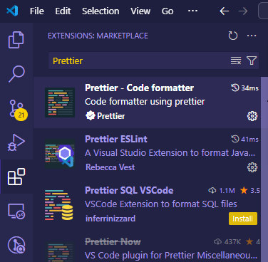
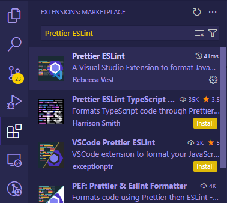

Neste artigo, vamos configurar o Prettier e o ESLint no VS Code para um projeto Next.js. Utilizando essas ferramentas, você pode manter uma padronização de código em seu projeto, facilitando a leitura e a manutenção do código. Ao utilizar a extensão no VS Code, você pode formatar o código automaticamente e receber avisos sobre possíveis erros no código.

Vamos direto ao ponto!

## Instalando no seu projeto

Abra seu projeto no VS Code e então abra o terminal integrado. Execute o seguinte comendo para instalar o Prettier como uma dependência de desenvolvimento:

```bash
npm install prettier --save-dev
```

## Extensão "Prettier - Code formatter" no VS Code

Vá até a aba de **extensões** do VS Code e pesquise por _"Prettier - Code formatter"_ e instale a extensão.



## Instalando o ESLint no seu projeto

Execute o seguinte comando para instalar o ESLint como uma dependência de desenvolvimento:

```bash
npm install eslint --save-dev
```

Não fique preocupado em usar o ESLint. O Next.js integrou o suporte ao ESLint e [você pode ler aqui sobre essa integração](https://nextjs.org/docs/app/building-your-application/configuring/eslint).

## Extensão "Prettier ESLint" no VS Code

Vá até a aba de **extensões** do VS Code novamente e pesquise por _"Prettier ESLint"_ e instale a extensão.



<Alert>
  <IconInfo className="h-4 w-4" />
  <AlertTitle>Anotação</AlertTitle>
  <AlertDescription>
    Se você pesquisar somente por _"ESLint"_, você encontrará uma extensão
    oficial da Microsoft. Eu particulamente não a utilizo, pois a extensão
    _"Prettier ESLint"_ já faz o trabalho correto. Fique à vontade para testar
    ambas e ver qual se adapta melhor ao seu fluxo de trabalho.
  </AlertDescription>
</Alert>

## Integrando ESLint com o Prettier

Para integrar o ESLint com o Prettier precisamos instalar um pacote chamado `eslint-config-prettier`. Esse pacote desativa quaisquer regras que possam entrar em conflito com o Prettier. Execute o seguinte comando para instalar o pacote:

```bash
npm install eslint-config-prettier --save-dev
```

Agora instalado, crie um arquivo de nome `.eslintrc` na raiz do seu projeto e adicione o seguinte conteúdo:

```json showLineNumbers
{
  "extends": ["next", "next/core-web-vitals", "prettier"],
  "plugins": [],
  "rules": {}
}
```

O Prettier deve ir por último no array de `extends` para que possa garantir que o formato é aplicado após a formatação.

## Configurando o VS Code para formatar e salvar

Para ativar a formatação automática do Prettier e a correção de erros do ESLint ao salvar um arquivo, [adicione as seguintes configurações no arquivo `settings.json` do VS Code](https://code.visualstudio.com/docs/getstarted/settings#_settingsjson):

```json showLineNumbers
{
  "editor.defaultFormatter": "esbenp.prettier-vscode",
  "editor.formatOnSave": true,
  "editor.codeActionsOnSave": {
    "source.fixAll.eslint": true
  }
}
```

Na linha `3`, estamos definindo que queremos que seja formatado ao salvar o arquivo. Na linha `5`, estamos definindo que queremos que o ESLint corrija todos os erros ao salvar o arquivo.

<Alert>
  <IconInfo className="h-4 w-4" />
  <AlertTitle>Anotação</AlertTitle>
  <AlertDescription>
    Você pode criar no seu projeto uma pasta de nome `.vscode` e dentro dela um
    arquivo de nome `settings.json` para adicionar essas configurações. Assim,
    você pode compartilhar essas configurações com outros membros da equipe.
  </AlertDescription>
</Alert>

## Conclusão

Tudo pronto! 🎉 Agora você tem o Prettier e o ESLint configurados no seu projeto Next.js e no VS Code. Com essas ferramentas, você pode manter uma padronização de código em seu projeto, facilitando a leitura e a manutenção do código.
