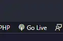
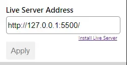
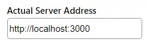
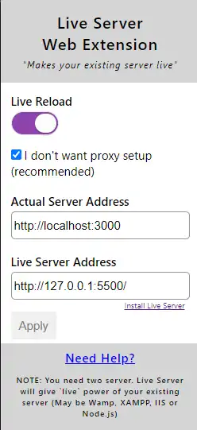

Tutorial simples e direto de como ativar o **Live Server** com PHP.

## Pré-requisitos

1. PHP instalado na máquina (aquele lance do PHP Path)
2. Instale a extensão **[Live Server](https://marketplace.visualstudio.com/items?itemName=ritwickdey.LiveServer)** no seu VS Code;
3. Instale a extensão **[PHP Server](https://marketplace.visualstudio.com/items?itemName=brapifra.phpserver)** no seu VS Code;
4. Instale a extensão **Live Server Web Extension** no seu navegador.

   - [Google Chrome](https://chrome.google.com/webstore/detail/live-server-web-extension/fiegdmejfepffgpnejdinekhfieaogmj)
   - [Firefox](https://addons.mozilla.org/pt-BR/firefox/addon/live-server-web-extension/)

## Configuração

### 1. Inicie o Live Server
Abra o VS Code e clique em `Go Live` para executar o Live Server que fica na parte inferior direita do programa. Vai abrir uma página no navegador.

### 2. Configure o Live Server Address
**Copie o endereço** da página aberta (o padrão é `http://127.0.0.1:5500/`), clique na **extensão instalada no seu navegador** e cole-o em "**Live Server Address**". Clique em `Apply`.

### 3. Configure o Actual Server Address
Na outra opção da extensão, de nome **"Actual Server Address"**, vamos colocar o endereço que o nosso PHP irá rodar, normalmente utilizamos `http://localhost:3000` e logo depois clique em `Apply`.

### 4. Inicie o servidor PHP
Agora rode o PHP na sua máquina em um prompt de comando. Utilizamos por padrão o `php -q -S localhost:3000` ou alguma outra forma que você costuma usar. Só lembre desse endereço ser o mesmo usado na etapa anterior.

### 5. Ative o Live Reload
Agora é só ativar a chave **Live Reload** na extensão que fica no início. Ao final teremos o seguinte:

### 6. Teste a configuração
Pronto! Agora é só abrir o endereço que está rodando o PHP, no caso desse tutorial é o `http://localhost:3000/`, no seu navegador.

## Pergunta frequente

Você pode se perguntar: _"Mas vou precisar ficar fazendo sempre isso?"_

**Não!** Feita uma vez só vai precisar ligar o Go Live e rodar o script PHP do projeto.

---

Espero que eu possa ter ajudado. Até a próxima! 🚀
