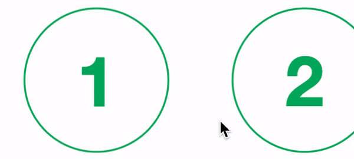

A `:hover` tem problemas desde que o primeiro navegador da Web foi instalado em um dispositivo com tela sensível ao toque. Claro que havia soluções, mas nenhuma delas era **a solução**. Mas parece que esse problema foi resolvido para sempre.

## Mas qual o grande problema mesmo?

Digamos que você simplesmente adicionou um `:hover` a um elemento de sua página, para que ele receba algum estilo quando o mouse passar sobre ele. Fácil né?


O problema surge quando o usuário interage com este elemento em uma tela sensível ao toque (um celular, tablet ou até mesmo uma tela touch de notebook). Após tocar no elemento, o efeito `:hover` fica preso no item. Isso também ocorre quando o elemento nem sequer é ativado pelo toque, por exemplo, se foi tocado durante a rolagem.

Se o _arrastar_ começar no elemento, o efeito de foco (`:hover`) é aplicado, porque *tecnicamente* o ponteiro (seu dedo na maioria das vezes) está sobre o elemento estilizado. **Este é um problema: em um dispositivo de toque, isso se traduz como alguma interação indesejada para o usuário.**

> No entanto, fica pior! Depois que terminar de arrastar, o efeito `:hover` permanece ativado!



Isso definitivamente **confundirá alguns de seus usuários**, o que nunca é bom. Algo precisa ser feito.

## Será que nunca teve uma solução?

Até existe e a maioria delas é abordada [neste excelente artigo](http://www.javascriptkit.com/dhtmltutors/sticky-hover-issue-solutions.shtml). O melhor deles inclui o uso de JavaScript para detectar se a tela tem recursos de toque. Recomendo a leitura para fins de estudo.

## Então, o que fazer exatamente?

> Do ponto de vista do desenvolvedor, estamos procurando uma solução que seja mais fácil de usar e manter.
>
> Do ponto de vista da UX, procuramos uma solução que seja o menos confusa e mais agradável para o usuário.

Isso significa que não há efeitos de foco em dispositivos com tela sensível ao toque. O caso especial aqui são os notebooks/laptops com telas sensíveis ao toque, mas podemos esperar que o mouse/touchpad seja usado na maior parte do tempo. Mesmo se houver um efeito de foco travado, o usuário pode usar facilmente o mouse/touchpad para verificar o problema e descartá-lo.

[Este é um site de teste](https://hover-pointer-media-query.glitch.me/) onde você pode testar seu próprio dispositivo para ver quais dessas consultas de mídia se aplicam a ele e também ver algumas das configurações dos dispositivos mais populares. Os navegadores Android têm algumas inconsistências, mas os outros dispositivos parecem ter isso resolvido. Verificando esses diferentes dispositivos, o resultado final é que em notebooks/laptops é possível solucionar com `@media(hover: hover) and (pointer: fine) {}`.

```css
@media (hover: hover) and (pointer: fine) {
  nav a:hover {
    background: yellow;
  }
}
```

Pode testar! 🤓

Mas e aí, o que você costumava fazer nesses casos? Estou muito feliz com essa solução, mas me avise se houver uma melhor por aí!

---

Espero que eu possa ter ajudado. Até a próxima! 🚀
