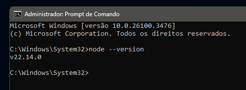
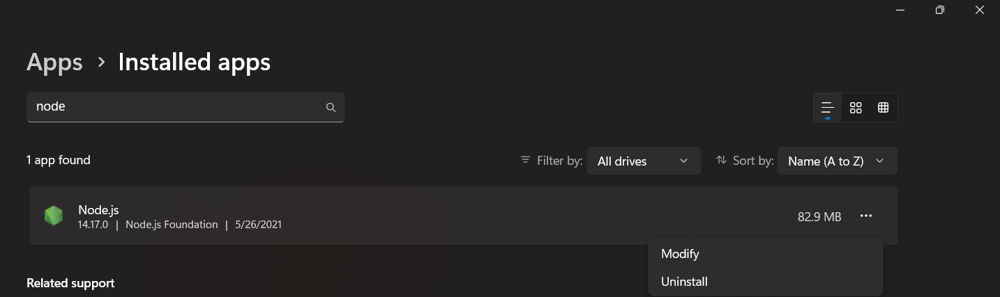
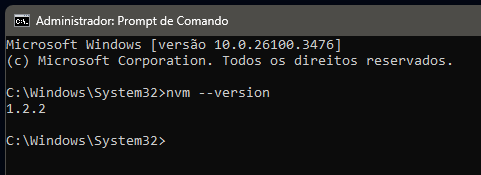
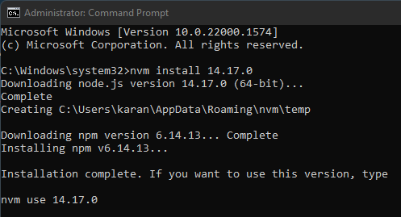
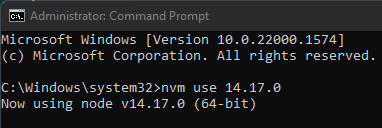
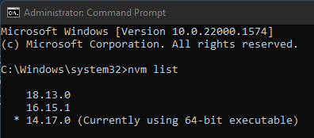

Se você está desenvolvendo uma aplicação web com algum framework moderno, é bem provável que em algum momento precise instalar o Node. Como diferentes projetos podem ter configurações de ambiente distintas, pode ser necessário instalar várias versões do Node na sua máquina. Como o Node não oferece uma funcionalidade nativa para ter múltiplas versões instaladas no mesmo sistema operacional, precisaremos usar o NVM, que significa Node Version Manager, para gerenciar essas versões.

## Pré-requisitos

Antes de instalarmos várias versões do Node através do NVM, você precisará desinstalar a versão atual do Node. Se você ainda não tem o Node instalado, pode pular direto para **Instalando NVM**.

## Verificando a Versão Atual do Node

Anote a versão do Node que está instalada atualmente antes de prosseguir com a desinstalação, pois precisaremos dessa informação mais tarde. Abra o prompt de comando no modo administrador e digite o seguinte:

```bash
node --version
```



## Remova o Node atual

Abra o **menu inicial do Windows** e pesquise por **Adicionar ou Remover programas**


Pesquise por "node" na barra de busca e clique para remover.



## Instalando NVM

[Baixe o arquivo nvm-setup.exe a partir deste link](https://github.com/coreybutler/nvm-windows/releases). Dê um duplo clique nele e siga as instruções para instalar o NVM. Não se preocupe; as configurações padrão são suficientes, então não há necessidade de personalizar nada.

Para verificar se a instalação foi bem-sucedida, digite o seguinte comando no prompt de comando:

```bash
nvm --version
```



Se a instalação for bem-sucedida, você verá um número de versão. Caso contrário, aparecerá a mensagem `node is not recognized as internal command`.

## Sobre o uso

Lembre-se de que, nos pré-requisitos, anotamos a versão do Node. Agora, vamos utilizá-la digitando o seguinte comando no prompt de comando para instalar o Node. No nosso exemplo, a versão era `22.14.0`, então usaremos essa.

```bash
nvm install 22.14.0
```



Para usar a versão que foi instalada, usamos o seguinte comando:

```bash
nvm use 22.14.0
```



Um comando útil é o `nvm list`, que exibirá todas as versões do Node instaladas na sua máquina. Ele também indicará qual versão está sendo utilizada atualmente, mostrando um `🞷` na frente do número da versão.



## Resumo

Pronto! Agora você pode ter várias versões do Node instaladas na sua máquina. Para recapitular, execute:

- `nvm install <versão>` para instalar uma versão específica.
- `nvm use <versão>` para alternar entre diferentes versões.
- `nvm list` para listar todas as versões instaladas na sua máquina.

Espero ter sido útil. Até a próxima!