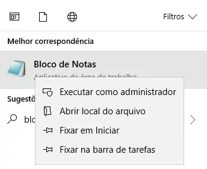
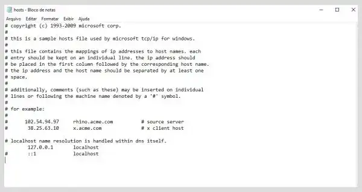
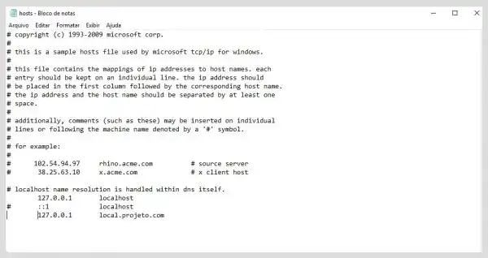
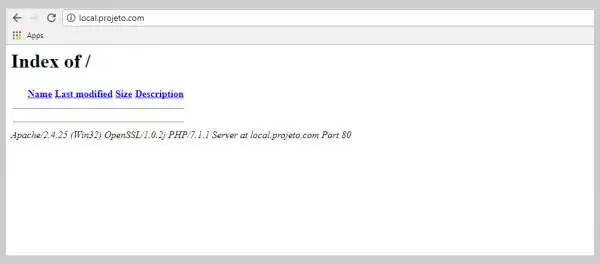

Vamos aprender a não usar mais um "localhost" e sim um domínio local mais sofisticado e próximo da realidade como "http://local.projeto.com". Ao invés de utilizar:

```
http://localhost/nomesite
```

Você pode utilizar ao mais próximo da realidade como:

```
http://local.projeto.com
```

Você pode criar qualquer nome, domínio ou subdomínio de acordo com seu gosto.

Basicamente, vamos configurar o Windows para quando acessar o domínio e apontar para nossa máquina (`localhost`) no Apache para uma pasta específica.

## 1. Editar arquivo `host`

Aperto o botão Windows e procure pelo "_Bloco de Notas_". **Aperte com o mouse direito sobre ele e execute como administrador.**



Depois basta ir em **Arquivo > Abrir**, ir no arquivo host (basta copiar o endereço `C:\Windows\System32\drivers\etc\hosts`) depois clicar em abrir.

Nesse arquivo, você encontrará o ip para sua máquina (`127.0.0.1`) com nome na frente “`localhost`”. Quando você digitar "`localhost`" no seu navegador, ele está apontando para sua máquina, então o Apache (Servidor Web) vai apontar para sua pasta.

Como estamos usando o XAMPP com a premissa de estar instalado no`C://`, ele irá apontar para: `C:\xampp\htdocs`.

O seu arquivo host será como esse abaixo:



Agora adicione o domínio que você deseja. No exemplo, vou criar um chamado _“local.projeto.com”_, ficando assim:

```
127.0.0.1       local.projeto.com
```

Veja como ficou:



## 2. Configurando Apache

Agora será necessário **configurar o Apache**. Também poderá ser feito com bloco de notas, ou qualquer editor de código.

Acesse o arquivo:

```
C:\xampp\apache\conf\extra\httpd-vhosts.conf
```

Nesse arquivo serão configurados os **Virtual Hosts**. Ele já vem com configurações de exemplo, porém em comentário.

Aqui ele. Vamos usá-lo como base:

```cmd
<VirtualHost \*:80>
  ServerAdmin webmaster@dummy-host.example.com DocumentRoot
  "C:/xampp/htdocs/dummy-host.example.com" ServerName dummy-host.example.com
  ServerAlias www.dummy-host.example.com ErrorLog
  "logs/dummy-host.example.com-error.log" CustomLog
  "logs/dummy-host.example.com-access.log" common
</VirtualHost>
```

Entendendo:

- **VirtualHost**: Tag definindo as configurações do virtual host.
- **ServerAdmin**: Endereço de contato.
- **DocumentRoot**: Caminho completo até a pasta que será acessada.
- **ServerName**: Nome do host que será acessado.
- **ServerAlias**: Nomes alternativos para o host.
- **ErrorLog**: Nome do arquivo que o servidor registrará os erros encontrados.
- **CustomLog**: Nome do arquivo para as requisições.

Iremos adicionar a nossa configuração, apontando para onde será configurado o virtual host. Aqui um exemplo de um projeto presente da pasta do XAMPP:

```
C:\xampp\htdocs\projeto
```

Ou seja, é uma pasta chamada "_projeto_".

Vamos configurar o **virtual host**:

```cmd /local.projeto.com/
<VirtualHost *:80>
    ServerAdmin webmaster@local.projeto.com
    DocumentRoot "C:/xampp/htdocs/projeto"
    ServerName local.projeto.com
    ErrorLog "logs/local.projeto.com-error.log"
    CustomLog "logs/local.projeto.com--access.log" common
</VirtualHost>
```

O único que não utilizamos é o _ServerAlias_, pois não teremos nomes alternativos para o ambiente local.

Se você já estiver iniciado o XAMPP, basta parar (Stop) e iniciar (Start) o Apache, caso contrário, basta só iniciar (Start) o Apache e depois acessa via URL o endereço que foi configurado.

## 3. Testando

Agora que tudo foi configurado e o XAMPP foi iniciado/reiniciado, vamos abrir `local.projeto.com` no navegador.



Pronto, você já pode trabalhar o seu projeto com **Virtual Host**. E para cada novo projeto, você pode criar um **Virtual Host** para se organizar melhor.
